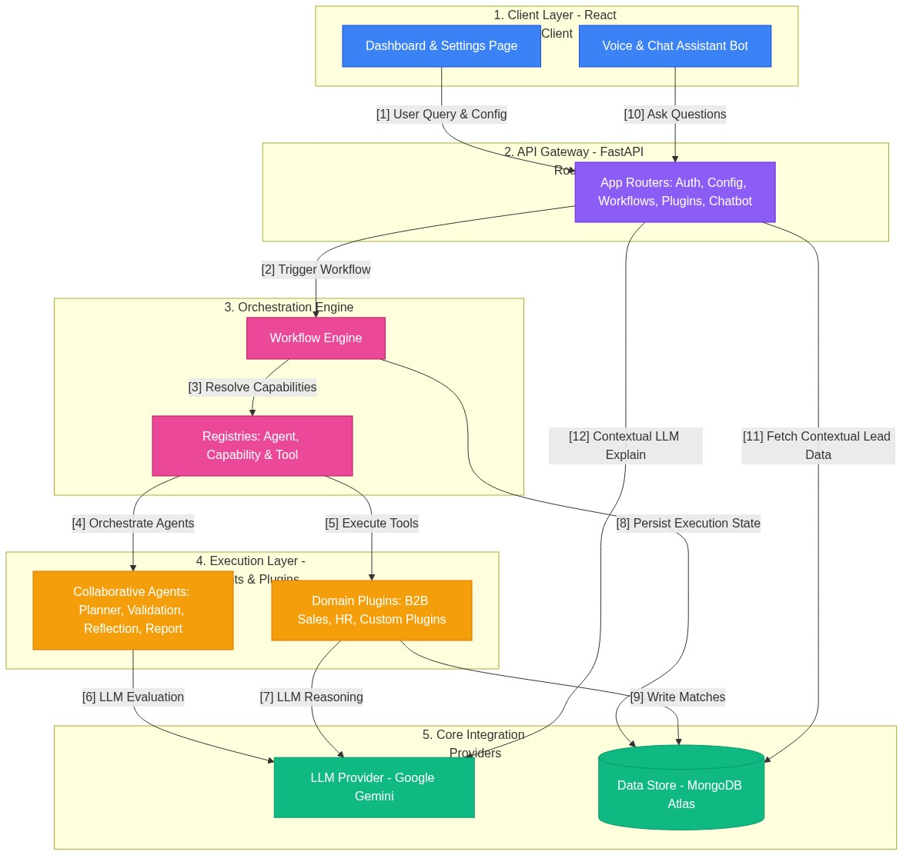
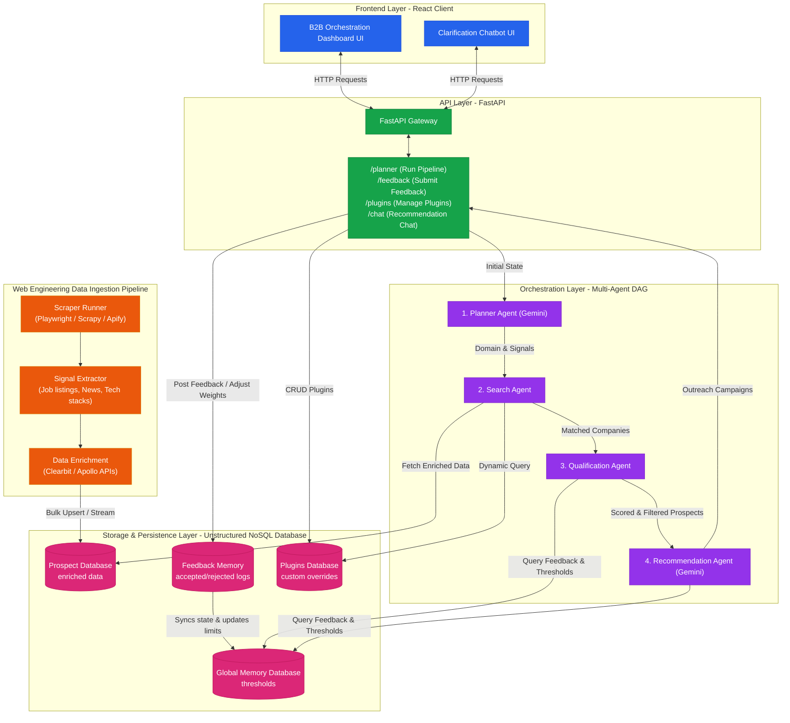

# 📐 High-Level Architecture & Key Design Decisions

This document outlines the system architecture, component interactions, and key engineering design decisions implemented in the **Agentic AI Platform**.

---

## 1. High-Level System Architecture

The platform uses a decoupled, registry-driven, multi-agent design. Rather than hardcoding workflows, the system dynamically plans and routes queries using a central registry of agents, capabilities, and tools.

---

## 2. Key Design Decisions

### 🚀 A. Reusability and Extensibility (Decoupled Domain Schema)
*   **Dynamic Size Units**: To evaluate leads across any domain, size constraints are not hardcoded. The system accepts dynamic size units (e.g. `beds` for hospitals, `sq ft` for space, `students` for colleges).
*   **Capability-Based Routing**: Agents and tools register generic capability tags (e.g., `contact_discovery`, `icp_matching`). The Planner compiles a task plan referencing these capability tags, which are resolved to agent executables at runtime by the registry.
*   **Asynchronous Plugin Lifecycle Manager**: Installs, initializes, enables, and disables business-specific domain plugins (like B2B Sales or custom creations) dynamically without server reboots.

### 🧠 B. Memory and Orchestration Design
*   **Stateless Agents with Persistent State Memory**: Agents are designed as stateless functions. All execution progress, step details, and lead qualifications are serialized and written directly to MongoDB Atlas at the end of each workflow step.
*   **Human-in-the-Loop (HITL) Checkpoints**: If a plugin flags a task as requiring approval (e.g., verifying leads before emailing), the Workflow Engine locks the execution state to `hitl_pending` and freezes until an manual action is submitted.
*   **State Sanitization**: Large text inputs and LLM logs are dynamically truncated to 5,000 characters before writing to MongoDB, preventing database buffer overflow crashes.

### 🛡️ C. Resiliency & Model Fallback Loops
*   **Model Tier List**: The Gemini Provider manages model failover: `gemini-2.5-flash` → `gemini-2.5-flash-lite` → `gemini-2.0-flash`.
*   **Backoff Retries**: Intercepts Google API `429 Rate Limit` responses, parses the recommended `retryDelay`, and sleeps before retrying.
*   **Local Heuristic Fallbacks**: If all Gemini models are exhausted, the backend switches to local heuristics and pre-mapped matching templates, guaranteeing zero 500 server crashes.

---

## 3. Lead Qualification Methodology

Lead qualification matches are evaluated by scoring candidates against configured rules:
*   **Organization Type Match (25%)**: Correlates the prospect category against selected options.
*   **Keyword Match (25%)**: Computes word density across scraped target profile metadata.
*   **Size Scope (25%)**: Verifies if the target is within minimum and maximum bounds for the custom unit.
*   **Custom Rule Evaluation (25%)**: The LLM audits scraped target data against plain-language guidelines (e.g., *"Must have terrace space"*), producing a binary score and direct explanation.

---

## 4. Voicebot & Conversational Context Flow

The Chatbot / Voicebot utilizes browser APIs combined with database memory to provide live explanations of qualified results:
1.  **Speech Recognition**: Transcribes mic input from the user.
2.  **State Lookup**: Fetches the workflow's qualified prospects and matching reasons from MongoDB based on the URL context.
3.  **Context Synthesis**: Instructs Gemini to summarize the qualification logic specifically for the user's question.
4.  **Speech Synthesis**: Reads the text response back to the user aloud.
