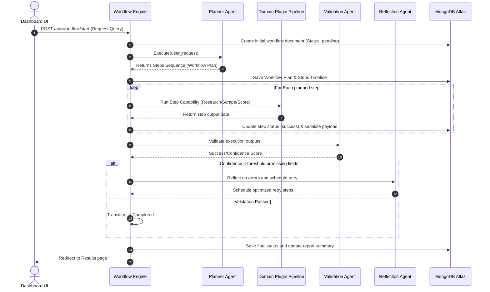

# 🏗️ Multi-Agent Orchestration & Platform Architecture (v3.0)

This document provides an exhaustive breakdown of the design decisions, component layouts, and execution patterns implemented in the **Agentic AI Platform**.

---

## 1. High-Level System Architecture

The platform follows a decoupled, registry-driven, multi-agent design. Rather than hardcoding workflows, the system dynamically plans and routes queries using a central registry of agents and capabilities.

```mermaid
graph TB
    subgraph Client Layer (Frontend React + Vite)
        UI[Dashboard, ICP Settings, Plugins page]
        AB[AssistantBot Chat / Voice Widget]
    end

    subgraph API Layer (FastAPI Router)
        AUTH[Auth Router]
        WORK[Workflow Router]
        PLUG[Plugins Router]
        CONF[Config Router]
        CHAT[Chatbot Router]
    end

    subgraph Orchestration Core
        WE[Workflow Engine]
        REG_A[Agent Registry]
        REG_C[Capability Registry]
        REG_T[Tool Registry]
    end

    subgraph Collaborative AI Agent Registry
        PLAN[Planner Agent]
        VAL[Validation Agent]
        REFL[Reflection Agent]
        REP[Report Generator]
        HITL[HITL Approval Agent]
    end

    subgraph Dynamic Domain Plugins
        B2B[B2B Sales Intel Plugin]
        HR[HR Recruitment Plugin]
        GEN[Generic Domain Plugin]
    end

    subgraph Tool Executions Layer
        SCRAPE[Web Scraper Tool]
        SCORE[ICP Scoring Engine]
        EMAIL[Email Finder / Contact Tool]
    end

    subgraph LLM Provider Layer
        LP[LLM Provider Abstraction]
        GEM[Gemini Provider with Fallback Loop]
    end

    subgraph Data Store
        DB[(MongoDB Atlas Database)]
    end

    %% Client and Router Connections
    UI -->|JSON / Bearer Token| API
    AB -->|POST /api/chatbot/query| CHAT
    
    subgraph API
        AUTH
        WORK
        PLUG
        CONF
        CHAT
    end

    %% Router to Orchestration
    WORK -->|Initialize| WE
    WE -->|Lookup Capabilities| REG_C
    WE -->|Resolve Agents| REG_A
    WE -->|Execute Steps| REG_T

    %% Orchestration to Agents
    REG_A --> PLAN
    REG_A --> VAL
    REG_A --> REFL
    REG_A --> REP
    REG_A --> HITL

    %% Plugins
    PLUG -->|Install / Initialize| PLIP[Plugin Lifecycle Manager]
    PLIP --> B2B
    PLIP --> HR
    PLIP --> GEN

    %% Tools
    REG_T --> SCRAPE
    REG_T --> SCORE
    REG_T --> EMAIL

    %% LLM connections
    PLAN & B2B & HR & REFL & CHAT --> LP
    LP --> GEM
    
    %% DB Connections
    WE & PLIP & CHAT --> DB

    style WE fill:#4f46e5,stroke:#4338ca,color:#fff
    style REG_C fill:#9333ea,stroke:#7e22ce,color:#fff
    style GEM fill:#0891b2,stroke:#0d9488,color:#fff
    style DB fill:#10b981,stroke:#059669,color:#fff
```

---

## 2. Platform Design Decisions (70% Evaluation Weight)

### 🚀 A. Reusability and Extensibility (Decoupled Domain Schema)
Traditional SaaS tools lock search criteria into fixed fields (e.g. employee count or B2B funding stage). To evaluate as a fully reusable platform, this design completely decouples the configuration domain:
1.  **Dynamic Size Units**: Users can specify bounds with a custom unit appropriate to their domain (e.g., `beds` for hospitals, `students` for schools, `sq ft` for real estate, `researchers` for laboratories).
2.  **Custom Qualification Requirements**: When creating a plugin, users define plain-text criteria (e.g., *"Must have open terrace space for panels"*). The generic B2B Sales plugin parses this dynamically at runtime using the LLM.
3.  **Plugin Lifecycle Manager**: Installs, initializes, and enables domain plugins asynchronously. Toggling a plugin registers its custom agents and capabilities into the platform's core registry on the fly.

### 🧠 B. Memory and Orchestration Design (State Machine & Persisted Execution)
The execution of a workflow is managed by a stateless **Workflow Engine** using a step-by-step state-machine.



*   **Execution Memory**: At every stage, the state payload is sanitized (truncating strings larger than 5,000 characters to prevent MongoDB payload overflow) and written to the `workflows` collection.
*   **Human-in-the-Loop (HITL) Checkpoints**: When a plugin requires manual approval (e.g. validating candidates or verifying outbound lead emails), the Workflow Engine updates the status to `hitl_pending` and pauses. Only when a manual approval request (`POST /api/hitl/action`) is received does the engine continue execution.

---

## 3. Lead Qualification Methodology (30% Evaluation Weight)

Lead qualification is computed dynamically by combining structured configuration rules with unstructured LLM reasoning.

### The Qualification Formula
$$Match Score = w_1(OrgType) + w_2(Keywords) + w_3(SizeRange) + w_4(Requirements)$$

Where weights ($w$) are balanced at runtime:
1.  **Organization Type Check ($w_1 = 0.25$)**: Matches the organization profile (e.g., Hospital) against target categories.
2.  **Keyword Correlation ($w_2 = 0.25$)**: Measures keyword frequency (e.g. Solar, Energy) in scraped profile meta-data.
3.  **Size Bounds Evaluation ($w_3 = 0.25$)**: Verifies if the target is within bounds of the configured unit (e.g. 50–200 beds).
4.  **Custom Criteria Audit ($w_4 = 0.25$)**: The LLM evaluates scraped website text against the custom requirements (e.g., *"Does this organization have open space?"*), producing a binary score and matching reason.

---

## 4. Voicebot & Chatbot Context Architecture

The Chatbot / Voicebot widget integrates browser capabilities with backend data stores to provide conversational context:

```
[Browser Mic Audio Input]
         │
         ▼ (HTML5 SpeechRecognition API)
  [Transcribed Text Query] + [Active Workflow ID]
         │
         ▼ (POST /api/chatbot/query)
  [FastAPI Backend Router]
         │
         ├──► Query MongoDB workflows collection
         │    (Pulls user request, matched prospects, scores, matching reasons)
         │
         ▼
  [Dynamic LLM Prompt Builder]
  (Combines System Guidelines + Workflow Context + User Question)
         │
         ▼
  [Gemini Provider (with fallback)] ──► Generates Explanation
         │
         ▼ (Axios JSON Response)
  [Frontend UI Chat message]
         │
         ▼ (HTML5 SpeechSynthesis Speech)
[Browser Audio Voice Output]
```

### Key Technologies:
*   **SpeechRecognition**: Uses browser-native speech recognition (`window.webkitSpeechRecognition`). Listens to user voice prompts and transcribes them.
*   **SpeechSynthesis**: Uses browser-native speech synthesis (`window.speechSynthesis`). Converts markdown text into clear, spoken audio.
*   **Quota Fallback Safeguard**: If Gemini API quotas are exhausted, the endpoint automatically routes to a local rule-based FAQ directory. It evaluates query keywords (e.g. "plugin", "ICP", "why") and responds with helper documentation.
